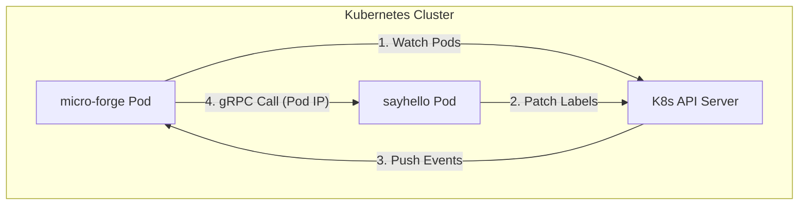

# Kubernetes 服务治理与 Kratos 服务发现原理

本文档详细介绍了在 Kubernetes 环境下，基于 Go Kratos 框架实现微服务治理与服务发现的原理及实施细节。

## 一、 整体架构

在 Kubernetes 集群中，Kratos 的服务治理机制并非依赖传统的 K8s Service (ClusterIP)，而是直接通过监听 Pod 的状态变化来实现应用层的负载均衡。



## 二、 核心组件

### 1. Registry (服务注册器)
负责将当前服务实例的信息注册到 Kubernetes。Kratos 采用的是 **Sidecar-less** 模式，直接通过 PATCH 当前 Pod 的 `labels` 和 `annotations` 来声明服务身份。

### 2. Discovery (服务发现器)
负责根据服务名称查找可用的服务实例列表。它使用 Kubernetes 的 **Informer** 机制，在本地缓存 Pod 列表，并通过监听 API Server 的事件实现秒级更新。

---

## 三、 服务注册原理 (Registration)

### 1. 注册时机
当 `kratos.App` 启动并调用 `Run()` 时，会自动调用配置好的 `Registrar.Register()`。

### 2. 注册细节
Kratos 通过 Kubernetes 客户端对当前 Pod 执行 **Strategic Merge Patch**。

**注入的 Labels:**
- `kratos-service-id`: 实例唯一 ID（通常是 Pod 名称）。
- `kratos-service-app`: 服务名称（对应配置中的 `app.name`）。
- `kratos-service-version`: 服务版本。

**注入的 Annotations:**
- `kratos-service-protocols`: 协议映射，例如 `{"8080": "grpc"}`。
- `kratos-service-metadata`: 自定义元数据。

### 3. RBAC 权限要求
服务注册需要对 Pod 执行 `patch` 和 `update` 操作。

```yaml
rules:
  - apiGroups: [""]
    resources: ["pods"]
    verbs: ["get", "patch", "update"]
```

---

## 四、 服务发现原理 (Discovery)

### 1. Informer 机制
`NewKubernetesDiscovery` 会创建一个 **SharedInformerFactory**。
- **关键点**：创建 Registry 实例后，必须显式调用 `reg.Start()`。否则 Informer 不会启动，本地缓存将始终为空，导致无法发现服务。

### 2. 查询逻辑
当发起 `discovery:///sayhello.service` 调用时：
1. **解析器**：识别 `discovery` 模式，提取服务名 `sayhello.service`。
2. **过滤**：从 Informer 缓存中筛选带有标签 `kratos-service-app=sayhello.service` 且 `Status.Phase == Running` 的 Pod。
3. **转换**：将 Pod 的 `IP` 和 `ContainerPort` 转换为 Kratos 识别的 `Endpoint` 格式（如 `grpc://10.244.0.10:8080`）。

### 3. 负载均衡
Kratos 客户端获取到实例列表后，在应用层执行负载均衡算法（如 RoundRobin），直接连接 Pod IP。

---

## 五、 项目实施细节

### 1. 初始化代码
在 `pkg/governance/registry/kubernetes.go` 中：

```go
func NewKubernetesDiscovery(c *conf.KubernetesConfig) registry.Discovery {
    // ... 创建客户端 ...
    reg := kuberegistry.NewRegistry(clientset, namespace)
    reg.Start() // 启动监听
    return reg
}
```

### 2. 部署建议 (Deployment)
虽然 Kratos 支持动态 Patch，但在生产环境下，建议在 Deployment 的 Pod 模板中 **静态预设 Labels**：

```yaml
template:
  metadata:
    labels:
      kratos-service-app: sayhello.service
```

这样做可以保证：
1. 服务注册更加可靠，不依赖运行时网络。
2. 提高服务启动速度（无需等待 Patch 完成）。
3. 即使权限受限，服务发现依然能通过静态标签工作。

## 六、 常见问题排查

### 1. 无法发现服务 (Deadline Exceeded)
- **检查 Informer 是否启动**：确保调用了 `reg.Start()`。
- **检查 RBAC 权限**：确认 ServiceAccount 是否有 Pods 的 `list` 和 `watch` 权限。
- **检查命名空间**：Kratos 默认只在当前命名空间发现服务，跨命名空间需要特殊配置。

### 2. 无法连接到服务
- **检查 Pod IP 可达性**：在 CNI 网络内，Pod IP 应当互通。
- **检查协议映射**：确认 Pod 的 Annotations 中协议是否为 `grpc`。

---
*更新时间：2026-01-29*
